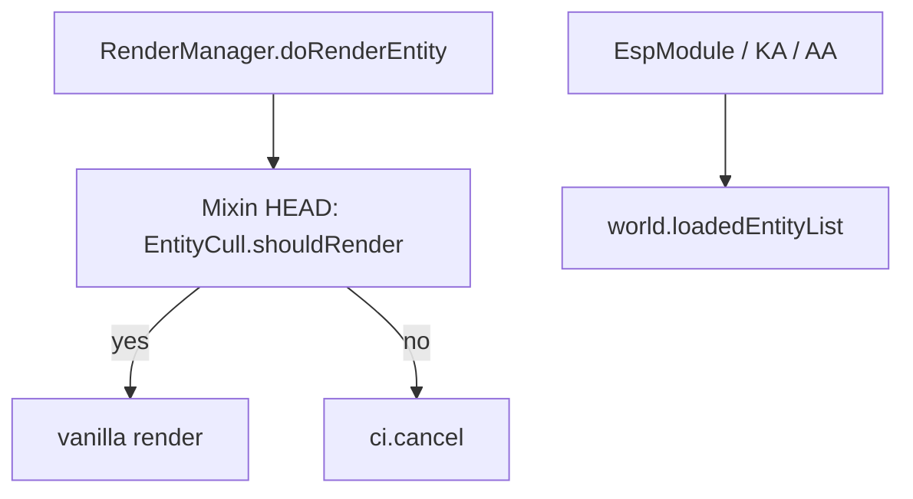

# Entity culling (Performance Phase 1)

**Date:** 2026-07-20  
**Status:** ready for user review  
**Ship path:** `gnuclient recode/`  
**Roadmap:** Phase 1 (this spec) → Phase 2 allocation/GC → Phase 3 safe multithreading (separate specs)

## Problem

Crowded lobbies and anticheat-test arenas render every loaded entity (items, armor stands, mobs, off-screen players), burning FPS. `PerformanceModule` already scales entity render distance via `MixinRenderManagerCull`, but there is no frustum cull or category skip.

## Goals

- Skip **vanilla entity rendering** for entities that are off-camera, beyond a hard distance (Aggressive), or in skippable categories (Aggressive).
- Keep combat, ESP, NameTags, and network ghosts **fully aware** of all entities (render-only gate).
- Controls: one master toggle + Lite / Aggressive preset under Performance (few knobs).

## Non-goals

- Occlusion culling (behind walls) — later upgrade, not Phase 1.
- Multithreading or allocation pools — Phases 2–3.
- Changing ESP / KillAura / AimAssist entity iteration.
- Chunk meshing / Sodium-style world renderer rewrite.
- Culled entities disappearing from ESP or combat targeting.

## Decisions (approved)

| Topic | Choice |
|-------|--------|
| Roadmap | Full stack over time: cull → alloc → threads |
| Cull style | Aggressive capability via presets (frustum + distance + category) |
| Combat / ESP | Render-only — never shared skip list |
| UI | `Entity Cull` master + `Cull Mode` Lite / Aggressive under Performance |
| Technique | Mixin cancel on `RenderManager.doRenderEntity` HEAD |

## Presets

| Mode | Frustum | Distance | Skip items | Skip armor stands | Skip non-player living |
|------|---------|----------|------------|-------------------|------------------------|
| Lite | yes | existing Reduced Entity Distance redirect only (unchanged) | no | no | no |
| Aggressive | yes | hard max **48** blocks from viewer | yes (`EntityItem`) | yes (`EntityArmorStand`) | yes (living that is not `EntityPlayer`) |

**Always render (never cancel):** local player, entity being ridden.

**Players:** never category-skipped; only frustum (+ Aggressive distance) can skip their vanilla model. ESP boxes for off-screen players still draw.

## Architecture

### `EntityCull` (new util)

- `shouldRenderEntity(Entity)` — pure decision used by the mixin.
- Order: master off → always true; never-skip self/ridden; Aggressive category; Aggressive distance; frustum AABB test.
- Frustum: `net.minecraft.client.renderer.culling.Frustum`, rebuilt **once per frame** (frame counter or first use with viewer pos), then reused.

### Mixin

- Keep existing `gnu$scaledRenderDistance` redirect for Reduced Entity Distance.
- Add `@Inject(method = "doRenderEntity", at = @At("HEAD"), cancellable = true)` calling `EntityCull.shouldRenderEntity`; cancel when false.
- OptiFine: if Fast Render conflicts in practice, gate with the same `OptiFineCompat.renderPathTweaksAllowed()` pattern as other Performance render tweaks; default assume cancel-at-HEAD is safe.

### `PerformanceModule`

- `BoolSetting("Entity Cull", false)`
- `ModeSetting("Cull Mode", Lite, [Lite, Aggressive]).visibleWhen(() -> entityCull.isToggled())`
- Static accessors: `entityCull()`, `cullModeAggressive()`, `aggressiveCullDistance()` (= 48f constant for Phase 1; no slider unless needed later)

## Files

| Path | Role |
|------|------|
| `module/modules/settings/PerformanceModule.java` | settings + accessors |
| `util/EntityCull.java` | decision + per-frame frustum cache |
| `mixin/impl/render/MixinRenderManagerCull.java` | HEAD inject (or sibling mixin same target) |

## Verification

1. Entity Cull **off** — entity visibility matches current build.
2. **Lite** — off-screen entities not rendered; on-screen players/items/mobs still render.
3. **Aggressive** — items, armor stands, mobs not rendered; on-screen players still render; ESP still shows off-screen players.
4. KillAura / AimAssist still acquire targets that are culled from vanilla render.
5. Self and ridden entity always visible.

## Out of scope follow-ups (document only)

- Phase 2: reduce per-tick allocations in hot paths (ESP buffers, combat lists).
- Phase 3: background prep for caches (not GL / not world mutation on workers).
- Future: true occlusion culling.
