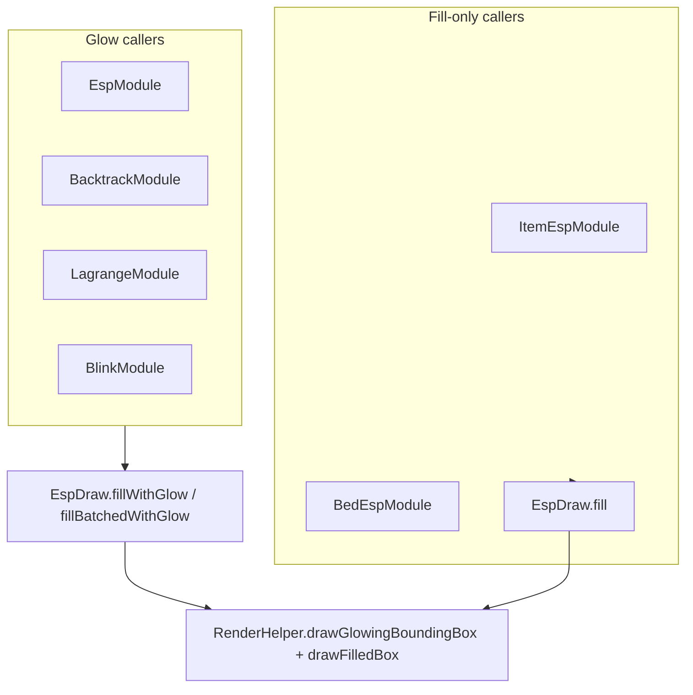

# ESP soft fill + glow outline (players + network ghosts)

**Date:** 2026-07-20  
**Status:** ready for user review  
**Ship path:** `gnuclient recode/`  
**Related:** supersedes fill-only look for player/network boxes from [[2026-07-11-esp-soft-fill-design]] (ItemESP / BedESP stay fill-only)

## Problem

Player and network ghost boxes are soft-fill only. User wants a soft outer **glow outline** like a bloomed wireframe (reference screenshot: luminous yellow edges), while keeping the translucent fill.

## Goals

- Soft fill **plus** multi-pass line bloom on scoped boxes.
- Glow RGB matches the box fill RGB.
- Always on (no new Glow setting).
- Single shared draw path so EspModule / Backtrack / Lagrange / Blink stay consistent.
- ItemESP and BedESP remain fill-only (no glow).

## Non-goals

- Fullscreen bloom / FBO shaders.
- ClickGUI / `UiBlur` changes.
- Glow on ItemESP, BedESP, or all scripts by default.
- Per-module Glow bool / strength sliders.

## Decisions (approved)

| Topic | Choice |
|-------|--------|
| Look | Soft fill + glow outline |
| Scope | Player ESP (EspModule + player script boxes that use the glow API) + network ghosts (Backtrack, Lagrange, Blink) |
| Controls | Always on |
| Technique | Multi-pass `GL_LINES` bloom in `RenderHelper` (not a shader) |

## Architecture

### `RenderHelper`

Add `drawGlowingBoundingBox(min..max, r,g,b, coreAlpha, lineWidthCore)`:

- ~3–4 passes: outer wide/low-alpha → inner narrower/higher-alpha → crisp core line
- Blend compatible with existing `begin()`/`end()` ESP state
- Does not replace `drawBoundingBox` (kept for non-glow wireframes / scripts)

### `EspDraw`

Add:

- `fillWithGlow(...)` — glow then soft fill (default fill alpha unchanged `0.16`)
- `fillBatchedWithGlow(...)` — same for float[] batches

Update class docs: no longer “fill-only”; plain `fill` / `fillBatched` stay for Item/Bed.

### Call-site wiring

| Module | Change |
|--------|--------|
| `EspModule` | Use `fillBatchedWithGlow` (or equivalent). Display-list / `drawFilledBoxList` path must also emit glow (route through helper or teach list path to draw glow) — no silent fill-only bypass |
| `BacktrackModule` | Ghost/server boxes → `fillWithGlow` |
| `LagrangeModule` | `drawGhostBox` → `fillWithGlow` |
| `BlinkModule` | Replace raw `drawBoundingBox` with `fillWithGlow` (add soft fill if currently outline-only, using default alpha) |
| `ItemEspModule` / `BedEspModule` | Unchanged (`fill` / `fillBatched`) |
| Script `Draw.entityBox` / `box` | Optional follow-up: glow variant for player scripts; not required for v1 if EspModule covers built-in player ESP |

## Verification

1. EspModule on: players show soft fill + visible outer glow in module RGB.
2. Backtrack / Lagrange / Blink ghosts: same glow treatment.
3. ItemESP / BedESP: still fill-only, no outline bloom.
4. Perf path (display lists if enabled): still shows glow.
5. `./gradlew compileJava` (and any existing ESP-related tests) passes.

## Risks

| Risk | Mitigation |
|------|------------|
| Glow too strong / washout | Tune layer widths/alphas once in `RenderHelper`; single knob for all callers |
| Display-list bypass skips glow | Explicitly wire EspModule perf path through glow helper |
| Soft-fill design conflict | This note documents intentional exception for players + network ghosts |
