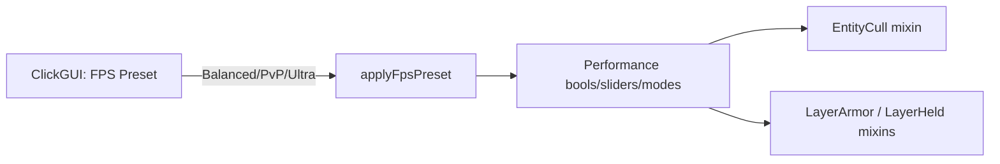

# FPS Max presets (Performance) + Ultra fast player models

**Date:** 2026-07-20  
**Status:** ready for user review  
**Ship path:** `gnuclient recode/`  
**Roadmap context:** Phase 1 entity cull done. Phase 2 allocations skipped. This is the high-impact FPS path; Phase 3b worker-core module prep is a **follow-up** if Ultra is still not enough.

## Problem

User wants **a lot more FPS**. Minecraft 1.8.9’s client is mostly single-threaded; unused CPU cores do not automatically help. Biggest wins come from **doing less on the main thread** (render skips + existing Performance toggles), not from rewriting the world renderer.

## Goals

- One **FPS Preset** on Performance: `Custom` / `Balanced` / `PvP` / `Ultra`.
- Selecting Balanced/PvP/Ultra **applies** a known bundle of existing Performance settings (Approach 1 — preset applicator).
- Ultra also enables **Fast Player Models** (skip other players’ armor + held-item layers).
- Combat / ESP remain correct (render-only skips; entity lists unchanged).
- After a manual edit of any covered setting, preset label becomes **Custom**.

## Non-goals

- Making vanilla Minecraft fully multicore / Sodium-style chunk meshing.
- Phase 2 allocation pools (skipped for now).
- Phase 3b worker threads (ESP/targeting prep) — separate later spec.
- Occlusion culling.
- Stripping local player first-person armor/hand.

## Decisions (approved)

| Topic | Choice |
|-------|--------|
| Strategy | FPS Max first, workers later if needed |
| Aggressiveness | Presets: Balanced / PvP / Ultra |
| Preset mechanics | Applicator that writes toggles (not live overlay) |
| Category entity skips | Reuse Entity Cull Aggressive (Phase 1) |
| Ultra exclusive | Fast Player Models (armor + held layers off for others) |

## Preset matrix

| Knob | Balanced | PvP | Ultra |
|------|----------|-----|-------|
| Entity Cull | on, Lite | on, Aggressive | on, Aggressive |
| Reduced Entity Distance | on, 0.75 | on, 0.5 | on, 0.4 |
| Particles | Reduced Particles on | Minimal Particles on | Minimal + Particle Limit 100 |
| Clear Weather | on | on | on |
| Clouds Off | on | on | on |
| Entity Shadows Off | on | on | on |
| Fast Graphics | off | on | on |
| No Entity Names | off | on | on |
| No Hurt Cam | off | on | on |
| No View Bobbing | off | on | on |
| Skip World When GUI Open | off | on | on |
| Fast Player Models | off | off | on |

`Custom` applies nothing. Selecting a named preset runs `applyFpsPreset` once.

### Dirty → Custom

While applying a preset, set `applyingPreset = true` so programmatic `setValue` calls do not mark dirty. After apply, clear the flag. Any subsequent user-driven change to a **covered** setting sets `fpsPreset` to Custom (index 0).

Covered settings = every knob in the matrix above (including Entity Cull / Cull Mode / Fast Player Models).

## Architecture

### `PerformanceModule`

- `ModeSetting("FPS Preset", 0, ["Custom", "Balanced", "PvP", "Ultra"])`
- On mode change to 1/2/3 → `applyFpsPreset(mode)`
- `BoolSetting("Fast Player Models", false)` — used by Ultra; visible always or when useful
- Static accessors: `fastPlayerModels()`, existing cull/particle accessors unchanged
- `applyFpsPreset` sets values per matrix (use existing `setValue` on settings)

### New mixins (Ultra / Fast Player Models)

- `MixinLayerArmorBase` — `@Inject` HEAD cancellable on `doRenderLayer` (or equivalent 1.8.9 method); cancel when `fastPlayerModels()` and entity is not local player
- `MixinLayerHeldItem` — same for held item layer
- Register in `mixins.gnuclient.json`
- OptiFine: if layer methods conflict, gate with existing `OptiFineCompat` patterns or fail soft (log once)

### Existing mixins

Particles, weather, clouds, shadows, names, hurt cam, GUI skip, Entity Cull — **reuse**; presets only flip settings that those mixins already read.

## Files

| Path | Role |
|------|------|
| `module/modules/settings/PerformanceModule.java` | Preset + apply + Fast Player Models + dirty tracking |
| `mixin/impl/render/MixinLayerArmorBase.java` | Skip armor layers |
| `mixin/impl/render/MixinLayerHeldItem.java` | Skip held-item layers |
| `resources/mixins.gnuclient.json` | Register mixins |

## Verification

1. FPS Preset = Custom → no automatic setting changes.
2. Select Balanced → Entity Cull Lite + reduced particles + clouds/weather/shadows as matrix; Fast Player Models off.
3. Select PvP → Aggressive cull + faster graphics + GUI skip; players still show armor.
4. Select Ultra → PvP bundle + Fast Player Models; other players render without armor/held item; self unchanged.
5. After Ultra, toggle Clouds Off manually → preset becomes Custom.
6. ESP boxes + KillAura still work with Ultra + Aggressive cull.
7. OptiFine Fast Render: settings that already `disabledWhen` stay disabled; no crash.

## Follow-up (Phase 3b — not this spec)

If Ultra is still insufficient: background worker prep for ESP/targeting caches (snapshot on main, no GL / no world mutation on workers).
