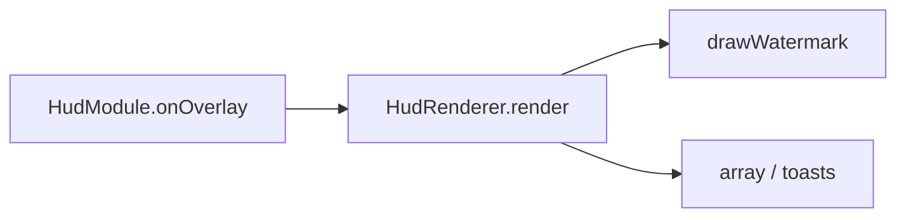

# Lux watermark (HUD top-left)

**Date:** 2026-07-20  
**Status:** ready for user review  
**Ship path:** `gnuclient recode/`

## Problem

User wants a compact top-left watermark like Astralis (`name | version | FPS`), styled to match the Lux ClickGUI.

## Goals

- Top-left accent-rim pill: **Lux | {version} | {fps} FPS**
- Lux theme tokens (`UiKit.SURFACE_STRONG`, `ACCENT` rim, `MUTED`/`TEXT`)
- Toggle under existing **HUD** module: `Watermark` (default on)
- Reuse `HudRenderer` + `UiFont` (Approach 1)

## Non-goals

- Draggable position / scale settings
- Extra stats (ping, BPS, coords)
- UiBlur behind the pill
- Separate Watermark module

## Decisions (approved)

| Topic | Choice |
|-------|--------|
| Brand | Lux |
| Chrome | Accent rim (SURFACE_STRONG + purple edge) |
| Placement | Top-left (~12px margin) |
| Host | HUD module bool `Watermark` |
| Draw | Inside `HudRenderer` |

## Look

```
┌─────────────────────────────┐  ← radius ~12–14, ACCENT 1px rim
│ Lux │ 1.8.1 │ 179 FPS       │  ← Lux = ACCENT; rest MUTED/TEXT; | = MUTED_DIM
└─────────────────────────────┘
  SURFACE_STRONG fill
```

- Brand: `UiKit.ACCENT` (#8B5CF6), semibold feel via normal UiFont
- Separators `|`: `UiKit.MUTED_DIM`
- Version + FPS: `UiKit.MUTED` (or `TEXT` if too dim in-game — prefer MUTED first)
- Padding: ~8–10px horizontal, ~6–8px vertical
- Screen margin: 12px from left and top (align with `ARRAY_MARGIN`)

## Behavior

- Requires `HudModule` enabled **and** `Watermark` toggled.
- Version string: `GnuClientMod.VERSION` (currently `1.8.1`).
- FPS: `Minecraft.getDebugFPS()` each overlay frame.
- `HudModule.shouldDrawOverlay()` returns true if watermark is wanted (even when Array/Notifications are off), so the overlay hook still runs.

## Architecture



### Files

| Path | Change |
|------|--------|
| `module/modules/visual/HudModule.java` | `Watermark` BoolSetting; `wantsWatermark()`; update `shouldDrawOverlay()` |
| `ui/hud/HudRenderer.java` | `drawWatermark(scale)` using UiKit + UiFont |

## Verification

1. HUD on, Watermark on → pill top-left with Lux / version / live FPS.
2. Watermark off → pill gone; array/toasts unchanged.
3. HUD off → nothing from HUD including watermark.
4. Array off + Notifications off + Watermark on → only watermark still draws.
5. Colors match ClickGUI accent/surface (no random purple/cream theme).
